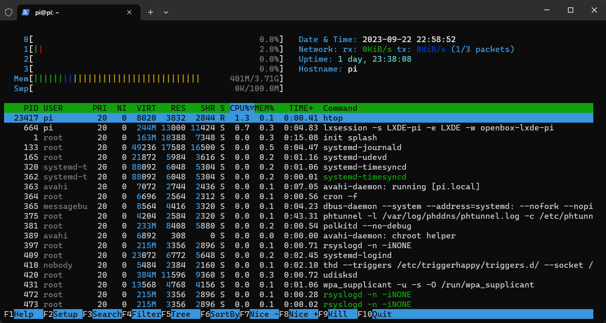
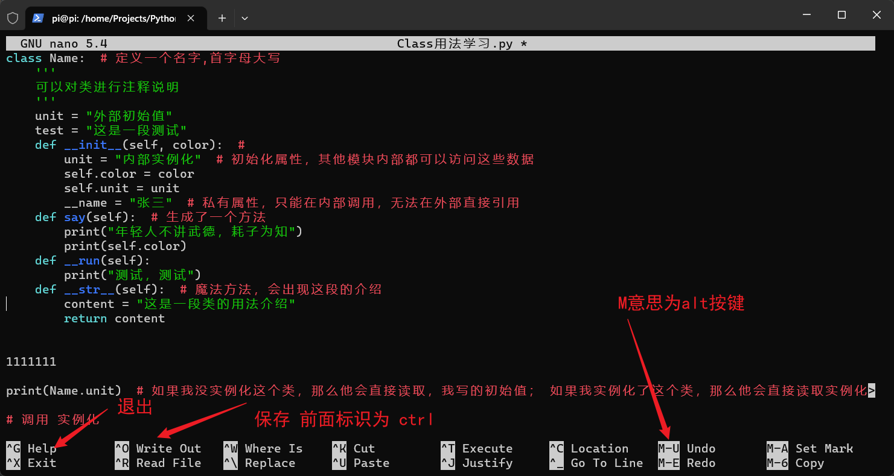
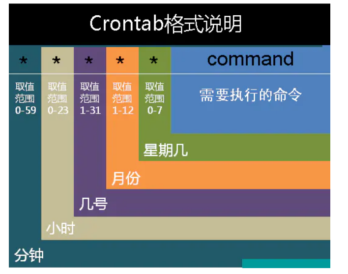

# Raspberry-Pi
树莓派资源整理汇总及分享

> 防背刺声明：'
> 
> 本仓库克隆于 xinxingli/Raspberry-Pi:master
> 但是很多连接已经失效，因此重新进行数据整理，方便用户直接按图找数据
> 
> 二次整理日期：2023.09.17


本文收集了树莓派使用过程中经常需要用到的资源，主要包括树莓派系统镜像、树莓派硬件介绍、树莓派GPIO引脚编号、
树莓派电路原理图下载、树莓派应用、加上笔者踩坑经验、部分常用的Linux命令

## 一、快速上手
所有资源均来自此网址：

[树莓派快速开机资源大全](https://shumeipai.nxez.com/download) ：包括**树莓派快速开机指南 、系统镜像下载、烧录软件，帮助您快速上手。**

### 补充说明无屏幕连接树莓派

无屏幕连接树莓派的核心有两个

1. 让树莓派连上网 
2. 获得树莓派的IP地址，网上有很多方式，我这里主要是采用查看路由器后台的方式获得IP地址

#### 1. 树莓派烧录方式
截止：23.9.22号 ：树莓派官方烧录软件，已经可以默认配置WIFI密码 开启SSH账号功能    
具体烧录，可以参考这个网址，烧录步骤比较详细    
**(如果是4B及以上版本，建议直接采用64位系统，据说，同配置4B 4G版本，64位性能超过32位系统 50%以上，有利于性能释放)**
https://zhuanlan.zhihu.com/p/612338843

PS： 

后面的Miniconda 的安装，暂时不建议看，貌似，现在miniconda 安装后 Pip  安装的库，都会出问题，引用不出来，因此
不建议下载此软件，管理Python包

如果用此步骤，烧录完成后，等待5分钟左右，路由器后台，就会出现一个 名称叫Pi的账号（建议烧录的时候名字就叫pi，方便区分
和辨识）

#### 2. 网线连接
网线连接，不需要wifi配置（不知道为啥，我明明烧录的时候wifi是对的，但是一直树莓派没显示，大概率是我密码配置错了）
网线连接后，通过烧录的账号和密码，进行登陆

登录后，按照 [树莓派wifi配置](https://zhuanlan.zhihu.com/p/471462383 )
这个步骤去操作一下，大概率就没问题，然后拔掉网线，让他用wifi连接即可


## 二、系统镜像

[树莓派（raspberrypi）常用镜像高速下载](https://make.quwj.com/member/2/bookmarks?category=37) ：收集了超过12种树莓派系统镜像，同时带有介绍，你可以选择一个最佳的树莓派系统，在页面即可下载系统镜像，非常方便。

目前 树莓派烧录软件中 有多个内置的系统镜像，可自行研究

## 三、硬件介绍

[树莓派开箱-上手简评](https://shumeipai.nxez.com/hot-explorer#beginner)

GPIO编号：[树莓派GPIO引脚对照表](https://shumeipai.nxez.com/raspberry-pi-pins-version-40)


## 四、树莓派软件源 & 镜像源

#### 1、国内常用软件源

由于树莓派软件在国外地址不方便更新，因此考虑更换到清华源，但是又可能存在一些问题，可能缺少公钥，或者是由于
架构问题，更新数据失败，因此需要多参考别人的先进经验

踩坑指南：一定要看一下自己的架构、型号，即：

> uname -m

按照代码去下放的链接中，找到对应的源，进行更新，否则就会出现各种各样的报错。

网址如下：   
http://btharp.com/article/2022/6/24/107.html


## 五、树莓派内网穿透

树莓派若需在公网去访问，就需要内网穿透，进行**内网穿透数据**。
个人公网要求较低，因此主要详细介绍花生壳内网穿透方式
###  (一)、花生壳内网穿透
#### 1.花生壳免费额度
每月限制1G流量，1MB带宽，2条映射

#### 2.  操作步骤
官方介绍已经很详细了，可以直接按照他的步骤来，本人亲测好评
[内网穿透](https://hsk.oray.com/news/23587.html)


另外一种内网穿透的补充
如果是后面对公网要求流量大，可以试试这个
4MB带宽，优惠后，一年25块钱；

[DDNSTO内网穿透](https://www.ddnsto.com/)
没试过树莓派使用这个DDNSTO，但是胜在带宽会大点，后面如果有需要，可做备选

#### 3.花生壳以前整理的知识点
树莓派花生壳内网穿透配置介绍

1、树莓派安装花生壳
我们先去花生壳找符合自己树莓派系统的安装包，这里我的树莓派是64位系统，
会提供一个wget的网址命令，下载完成。

接着输入sudo depkg -i pi.deb等待安装完毕即可。
安装完毕后就会显示设备账户初始信息，包括SN码和初始密码，
以及远程管理网址，当然之后也可以通过命令sudo phddns status来查看：

> sudo phddns ,输入此命令，可以查看花生壳的内网穿透状态
> 
> sudo 主指令：phddns
> 
> phddns start（启动 花生壳）
> phddns version（查看版本 花生壳）
> phddns stop（停止 花生壳）
> 
> phddns restart（重启 花生壳）
> phddns  reset（重置 花生壳）
> 
> phddns  enable（开机自启动 花生壳）
> phddns  status（状态 花生壳），查看状态这里面有SN码。


在浏览器输入网址http://b.oray.com进入远程管理接口，
在终端中输入SN账号和密码
输入对应的SN码和密码，就能进去管理页面，然后进行绑定手机和重置密码等简单操作。

然后在设置映射关系，把得到的网址和端口 映射出来，就可以使用这个网址和端口，进行SHH操作。


### (二)、获取公网IP，直接公网访问
找运营商，索要IPV4/6的公网IP，此网址大多为动态IP（这一步难度有点大）

利用ipv4/6 开通公网，然后设置 路由器，开启 IPV6相关功能，这一步属于相对简单

购买一个域名，**这个域名注册简单，但是还需要备案**，备案步骤繁琐，暂时不想搞（需要购买云服务器等设备）

（更新： 问了腾讯云客服，购买域名， 不用80和403端口，主要用来做解析，固定公网ip 是大概不用备案，先确定自己的账号是不是 已经开放公网ip
然后在折腾一下，路由器刷个固件升级，说不定才可以整，步骤太多了，如果后面稳定下来在整
**没必要为了这种事情，瞎折腾**
）

这个域名，主要是为了 把动态的公网地址，
转化成静态的 域名地址信息，方便进行转换。


## 六、树莓派应用

仅整理自己想要尝试的项目，更多项目，在此链接中寻找

[树莓派可以用来什么？](https://shumeipai.nxez.com/what-raspi-used-for)

### 个人尝试的项目

1. [Pi Dashboard (Pi 仪表盘)](https://make.quwj.com/project/10)
2. 在树莓派闲置的时候，上传PCDN 利用网心云赚点钱 [具体链接](https://help.onethingcloud.com/7cb4/3ed5/39ae) (PS：如果链接挂了，可以直接点击此 跳转到[首页](https://help.onethingcloud.com/7cb4/3ed5)，待补充) 

### Pycharm 远程部署

建议按照这上面的行为进行部署到树莓派中

https://zhuanlan.zhihu.com/p/267836740


PS：

还有一种做法，就是在开发机上，直接进行编写代码，提交到Github上

在树莓派中，进行git pull并合并 拉取项目，运行项目

## 七、树莓派相关手册
在此处阅读
[raspberry-pi-beginners-guide-zh-cn-v1.1.pdf](raspberry-pi-beginners-guide-zh-cn-v1.1.pdf)

## 八、树莓派其他配套相关知识
### 1.树莓派版本
Raspberry Pi 树莓派已经发布了很多个版本。每一版树莓派都有唯一的版本代号，通过下面这行命令可以查看这个代号：

cat /proc/cpuinfo

最后三行表示主板的硬件型号、版本代号和唯一的序列号

[有兴趣请点击此链接了解详情](https://shumeipai.nxez.com/raspberry-pi-revision-codes)

# 九、其他碎碎念
1.散热问题：如果不常用的话，散热就整个小风扇吹一吹就可以；如果常用的话，且4核CPU 占用100%，那么就需要注意散热问题。

超过85度，CPU会自动降频；我是使用了一个金属结构的被动散热，加上两个小风扇，吹一吹。 CPU全开的情况下，2个小时CPU温度不超过55度
，差点觉得 CPU会被冻感冒 =-=

2.树莓派配置推荐

个人 设备介绍： 
树莓派4B，
内存卡128GB （京东50+买的）（实际上16G内存应该也够用）
有土豪金散热装置
读卡器


# 树莓派相关方式和记录
由于树莓派他是基于Linux进行编译，跟习惯于Windows 的人来说，会非常不习惯的界面和操作。很容易直接被vi 代码，直接进行劝退，因此，我在此也分享对一些关于Linux的一些操作
和相关的介绍，知识点相当浅薄，要用的时候，建议多使用chatgtp进行合理提问和开发。

## 树莓派常规维护和编辑
树莓派是属于通电即开机，因此常用的命令为  sudo reboot；这个命令为重启电脑，关机为 shutdown

树莓派类似Windows电脑任务管理器的界面：htop，他可以看到多核CPU的运行情况，内存，详细的任务视图，下方还有一些可以对这个界面进行自定义，显示相关数据，基本满足你对树莓派基本的监控需求



## 树莓派相关信息查询

1.树莓派查看CPU温度
vcgencmd measure_temp

2.查看内存空间
free -h

3.查看硬盘空间
df -h


## 树莓派的编辑和查看文件
Linux的文件权限要求，编辑，查看数据的步骤繁琐

linux 返回上一层级 cd ..

linux 查看目录 ls

linux 查看目录下内容 此命令会 跳转到 pi文件夹里 cd /Home/pi/

linux 授予该目录 读取 写入 执行权限 chmod 777 filepath：如果你无法写入文件的时候，可能是你在普通模式下 ，没有这个文件的写入权限，因此
使用chmod 权限可以授予所有用户这个权限

linux 读取文本的内容 cat xx.txt

linux 编辑文本信息，这里暂时建议使用 nano 进行文本编辑，原因是 所见即所得，比较适合操作习惯
常用的就是保存和退出ctrl+O ctrl+X符号

如图




## 定时任务

crontab 定时任务
用crontab写每月第二周周五运行名为a.py的Python脚本,需要使用以下写法:

*/15 * * * 5#2 /usr/bin/python3 /path/to/a.py

详细说明:

*/15 * * * 5#2:

*/15 设置每15分钟运行一次 表示每月每年 5 表示周五 #2表示该月的第二周 /usr/bin/python3:

指定使用  python3解释器执行脚本  /path/to/a.py:

指定要运行的Python脚本路径 总体来说:

每15分钟执行一次 在每月第二周的周五 使用python3运行脚本/path/to/a.py 所以这条crontab可以实现每个月第二周的周五定时运行a.py这个Python脚本任务。

当任务需要在指定时间、日期运行时,通过结合分钟、小时、日期、月份、周几等字段以及#加周数语法就可以方便描述出来。





## 1.下载文件

发现一个非常好的github项目，涉及到非常多的linux命令，可以
一个学习的项目： [linux项目](https://wangchujiang.com/linux-command/c/wget.html)
使用的时候，直接在搜索即可


使用wget 下载文件
wget -O file:name https://xxx  格式 下载文件


## 安装和卸载软件

dpkg
Debian Linux系统上安装、创建和管理软件包

* dpkg -i package.deb     # 安装包
* dpkg -r package         # 删除包
* dpkg -P package         # 删除包（包括配置文件）

## 命令补全软件-oh-my-zsh

>
> Zsh 完全兼容 bash，支持强大的智能命令补全功能，
> 支持大量的界面主题和插件，功能和效率都极大的增强和提高。
> 
> 

[网页教程介绍](https://sysin.org/blog/linux-zsh/)


## 2.Linux 文件压缩和解压

> 关键词：`tar`, `gzip`, `zip`, `unzip`
> 
>


## 删除文件
在Linux中，`rm`是一个用于删除文件或目录的命令。

以下是一些常用的`rm`命令选项和用法：

1. 删除一个文件：
   ```
   rm filename
   ```

2. 删除多个文件：
   ```
   rm file1 file2 file3
   ```

3. 删除一个目录及其内容：
   ```
   rm -r directory
   ```

   使用`-r`选项来递归删除目录及其内部的所有文件和子目录。

4. 静默删除文件，不发出任何警告或确认：
   ```
   rm -f filename
   ```

   使用`-f`选项会强制删除文件，而不会询问确认。

5. 删除空目录：
   ```
   rmdir directory
   ```

   使用`rmdir`命令可以删除空目录。
6. 删除目录和目录里面的文件
   ```
   rm -rf  directory
   ```

请注意，`rm`命令是不可逆的，删除后的文件将无法恢复。因此，在使用`rm`命令时要小心确认你要删除的文件或目录。特别是在使用`-r`选项递归删除目录时，请务必谨慎操作，以免误删重要文件。

## 代理节点

如果只想代理某一条语句的执行，比如下载文件（使用 curl 或 wget 命令）或者克隆仓库，
推送更改等（git），直接在需要执行的语句前加上 gg 就可以

如果需要代理整个ssh会话的所有命令，只需要执行
gg bash
